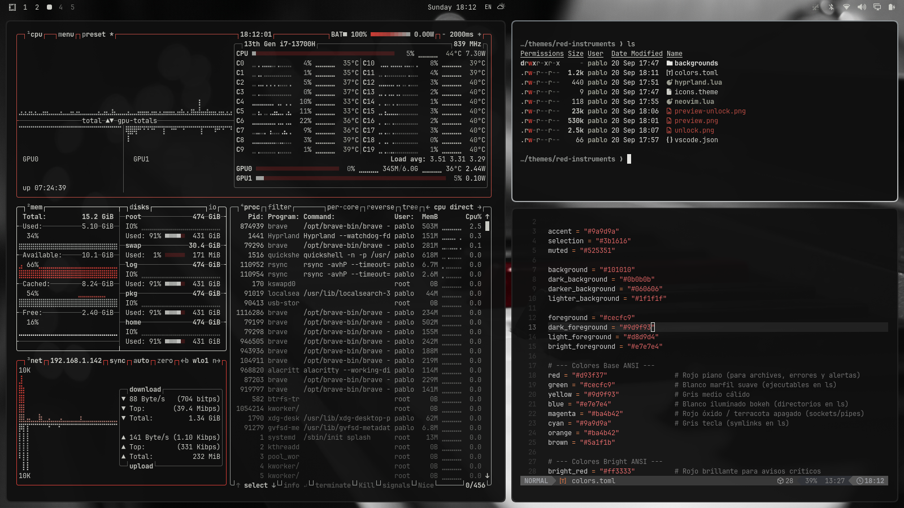
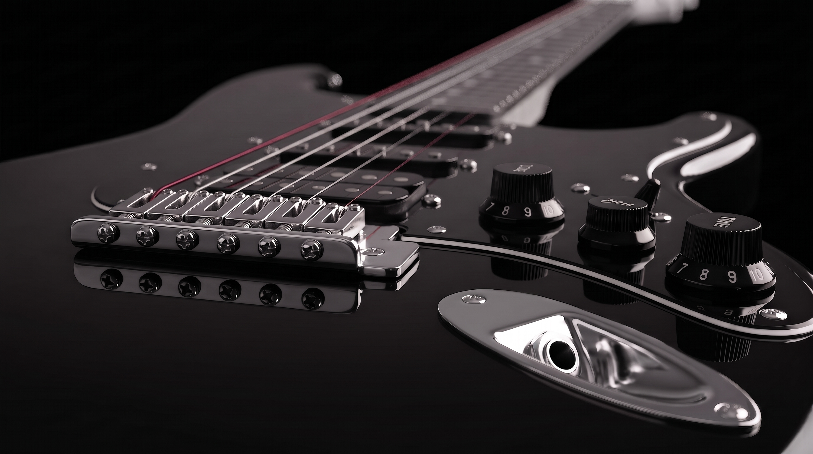
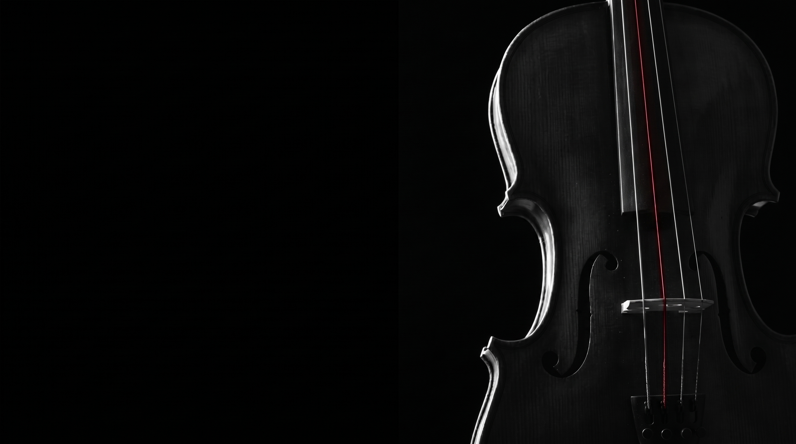
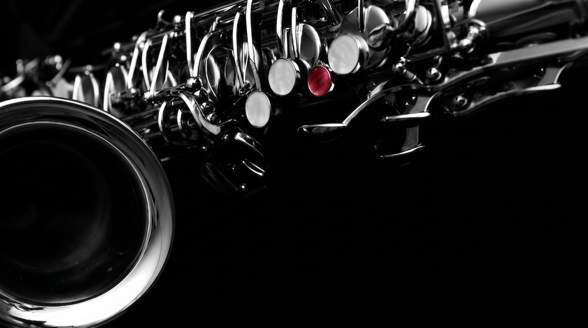

# Red Instruments Theme for Omarchy

**Red Instruments** is a dark, selective-color theme for Omarchy. Inspired by monochrome musical photography with subtle, striking crimson highlights, this theme blends deep charcoal and pure black bases with ivory text, soft gray tones, and sharp crimson accents on key elements.

---

## Previews

### Theme Overview


### Wallpapers Included
The theme includes a curated set of monochrome instrument backgrounds with selective crimson accents:

| **Piano** | **Guitar (Variation 1)** |
| :---: | :---: |
|  |  |

| **Guitar (Variation 2)** | **Cello** |
| :---: | :---: |
|  |  |

| **Drums** | **Saxophone** |
| :---: | :---: |
|  |  |

| **Trumpet** | **Vinyl Record** |
| :---: | :---: |
|  |  |

---

## Installation

Install the theme via the Omarchy CLI:

```bash
omarchy theme install <your-github-username>/red-instruments
```

To set and apply the theme:

```bash
omarchy theme set red-instruments
```

---

## Important Note on Configuration Files (`.lua`, `vscode.json`, etc.)

Due to Omarchy's security design, third-party code files are stripped during automatic theme installation:

> *"A theme you install from someone else's repo with `omarchy theme install` keeps everything that's colour, and loses the handful of files that would run code on your machine: any `.lua` file, the terminal configs (`alacritty.toml`, `foot.ini`, `ghostty.conf`, `kitty.conf`), and `vscode.json`. A theme's `hyprland.lua` is Lua your compositor runs at login, a terminal config names the program your terminal starts, and `vscode.json` names a VSCode extension to install. Installing someone's theme should change what your desktop looks like, never what it runs.*
>
> *Everything else still works exactly as the theme author wrote it — `btop.theme`, `chromium.theme`, `helix.toml`, `icons.theme`, `shell.toml`, the backgrounds and the previews are all kept. Only what was dropped gets regenerated from `colors.toml` on your machine."*
> — *Omarchy Documentation*

### Enabling Custom Lua & VS Code Configs Manually
If you want to use the included Hyprland settings, Neovim styles, or VS Code presets provided in this repo, you can clone and copy them explicitly:

```bash
# Clone the repository manually
git clone https://github.com/<your-github-username>/red-instruments.git /tmp/red-instruments

# Copy the custom Lua and VS Code definitions into your local theme directory
cp /tmp/red-instruments/hyprland.lua ~/.config/omarchy/themes/red-instruments/
cp /tmp/red-instruments/neovim.lua ~/.config/omarchy/themes/red-instruments/
cp /tmp/red-instruments/vscode.json ~/.config/omarchy/themes/red-instruments/

# Clean up
rm -rf /tmp/red-instruments
```